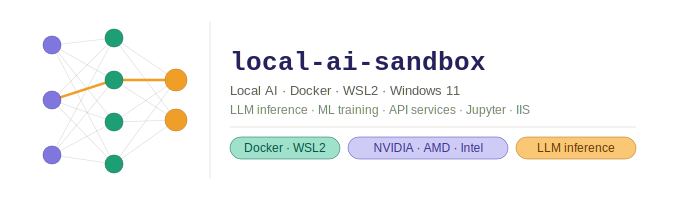

# local-ai-sandbox

A fully documented Docker-based AI experimentation sandbox for Windows 11 — designed as a local-first alpha and pre-production testing platform for AI features before promoting to cloud-hosted services.


---

## What This Is

A personal sandbox environment for running AI workloads locally in isolated Docker containers on Windows 11 via WSL2. Build and validate against real LLM inference, train models, and test API integrations — without cloud costs, rate limits, or data leaving your machine.

---

## Stack

| Layer | Technology |
|-------|-----------|
| Host OS | Windows 11 (22H2+) |
| Containers | Docker Desktop 4.x · WSL2 backend · containerd |
| Linux Environment | Ubuntu 24.04 (WSL2) |
| LLM Inference | Ollama · llama.cpp (GGUF) |
| ML Training | PyTorch (CUDA) · TensorFlow-DirectML |
| API Services | FastAPI · Uvicorn |
| Notebooks | JupyterLab |
| IIS Integration | Windows containers · nginx reverse proxy |

---

## GPU Support

| Hardware | Path |
|----------|------|
| NVIDIA GeForce / RTX / Quadro | CUDA + NVIDIA Container Toolkit |
| AMD Radeon / RX / Pro | DirectML via `/dev/dxg` |
| Intel UHD / Iris Xe / Arc | OpenVINO 2025 + DirectML + IPEX |

---

## Repo Contents

```
local-ai-sandbox/
├── README.md                        ← this file
├── docker-compose.yml               ← full sandbox stack
├── .env.example                     ← environment variable template
├── docker-ai-sandbox-guide.md       ← complete setup and configuration guide
├── docker-local-ai-article.md       ← article: local AI as an alpha testing platform
├── api/
│   ├── Dockerfile                   ← FastAPI backend
│   ├── main.py
│   └── requirements.txt
└── trainer/
    ├── Dockerfile                   ← PyTorch ML trainer (on-demand)
    └── requirements.txt
```

---

## Quick Start

**Prerequisites:** Windows 11, virtualisation enabled in BIOS, Docker Desktop installed.

```powershell
# 1. Install WSL2 with Ubuntu 24.04
wsl --install -d Ubuntu-24.04
wsl --set-default Ubuntu-24.04
```

```bash
# 2. Clone the repo into the WSL2 Linux filesystem (faster than /mnt/c/)
cd ~
git clone https://github.com/<your-username>/local-ai-sandbox.git
cd local-ai-sandbox

# 3. Copy and edit the environment file
cp .env.example .env
nano .env

# 4. Validate the Compose file
docker compose config

# 5. Start the default stack
docker compose up -d

# 6. Pull and run a model
docker exec -it ollama ollama pull llama3.2:1b
docker exec -it ollama ollama run llama3.2:1b "Hello from local AI"
```

Access points once running:

| Service | URL |
|---------|-----|
| Ollama inference API | http://localhost:11434 |
| FastAPI backend | http://localhost:8000 |
| JupyterLab | http://localhost:8888 |
| Portainer (if enabled) | https://localhost:9443 |

---

## Documentation

The full setup guide covers every step from scratch, written for both beginners and experienced developers:

- **[docker-ai-sandbox-guide.md](./docs/docker-ai-sandbox-guide.md)** — 12-section guide covering WSL2 setup, Docker Desktop configuration, GPU passthrough (NVIDIA / AMD / Intel), performance tuning, security hardening, all workload Dockerfiles, Compose stack, networking, storage, and monitoring.

Key sections:
- **Section 4** — GPU passthrough for NVIDIA, AMD, and Intel (including OpenVINO 2025 install)
- **Section 5** — Performance tuning (BuildKit, shared memory, Linux filesystem placement)
- **Section 6** — Security hardening (non-root users, secrets, network isolation)
- **Section 8** — Full `docker-compose.yml` with all services wired together

---

## ML Trainer (On-Demand)

The PyTorch training container is not started by default. Run it only when needed:

```bash
docker compose --profile training up -d
```

---

## Notes

- Store model weights and datasets under `~/local-ai-sandbox/` inside WSL2 — not under `/mnt/c/`. Linux filesystem access is 5–10× faster for AI workloads.
- Never commit `.env` or `secrets/` to version control — both are in `.gitignore`.
- Run `docker compose config` before every `docker compose up` to catch errors early.
- Intel integrated GPU (UHD / Iris Xe) supports models up to ~3B parameters. Intel Arc discrete GPUs perform 3–5× faster.

---

## License

MIT