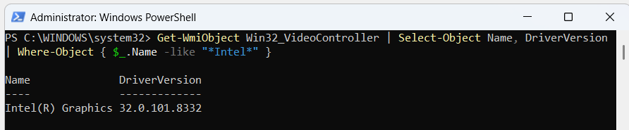
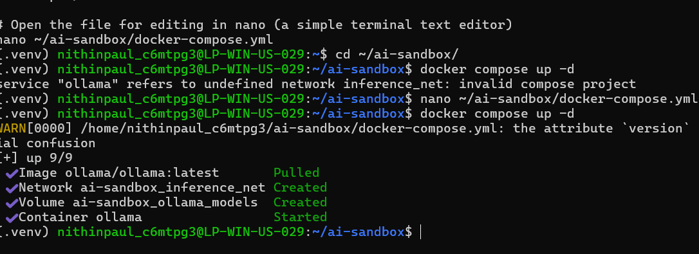
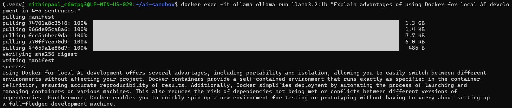

# Docker AI Experimentation Sandbox — Windows 11 Setup Guide

> **Target Environment:** Windows 11 · Docker Desktop (WSL2 backend) · AI/ML Workloads  
> **Scope:** LLM Inference · Python ML Training · API/Backend Services · Jupyter Notebooks · IIS-Hosted Services  
> **GPU:** Both NVIDIA and AMD paths documented (choose based on your hardware)

---

## Table of Contents

1. [Prerequisites & System Check](#1-prerequisites--system-check)
2. [Enable WSL2 & Virtualization](#2-enable-wsl2--virtualization)
3. [Install Docker Desktop](#3-install-docker-desktop)
4. [GPU Passthrough Configuration](#4-gpu-passthrough-configuration)
   - [Option A — NVIDIA GPU](#option-a--nvidia-gpu)
   - [Option B — AMD GPU](#option-b--amd-gpu)
5. [Docker Performance Tuning](#5-docker-performance-tuning)
6. [Security Hardening](#6-security-hardening)
7. [Workload-Specific Container Setups](#7-workload-specific-container-setups)
   - [A. LLM Inference (Ollama / llama.cpp)](#a-llm-inference-ollama--llamacpp)
   - [B. Python ML Training (PyTorch / TensorFlow)](#b-python-ml-training-pytorch--tensorflow)
   - [C. API / Backend Services](#c-api--backend-services)
   - [D. Jupyter Notebooks](#d-jupyter-notebooks)
   - [E. IIS-Hosted Services & Apps](#e-iis-hosted-services--apps)
8. [Compose: Full Sandbox Stack](#8-compose-full-sandbox-stack)
9. [Networking Best Practices](#9-networking-best-practices)
10. [Persistent Storage Strategy](#10-persistent-storage-strategy)
11. [Monitoring & Resource Limits](#11-monitoring--resource-limits)
12. [Useful Commands Cheat Sheet](#12-useful-commands-cheat-sheet)

---

## 1. Prerequisites & System Check

### Minimum Hardware Requirements

| Component | Minimum | Recommended |
|-----------|---------|-------------|
| RAM | 16 GB | 32 GB+ |
| Disk (free) | 60 GB | 200 GB+ (NVMe SSD) |
| CPU | 4 cores / 8 threads | 8+ cores |
| GPU VRAM | — | 8 GB+ for LLM inference |

### Check Virtualization is Enabled

Open **PowerShell (Admin)** and run:

```powershell
# Check virtualization support
systeminfo | findstr /i "virtualization"

# Check Hyper-V status
Get-WindowsOptionalFeature -Online -FeatureName Microsoft-Hyper-V-All
```

> If virtualization is disabled, enable it in your BIOS/UEFI under **SVM Mode** (AMD) or **Intel VT-x**.

---

## 2. Enable WSL2 & Virtualization

WSL2 is Docker Desktop's recommended backend on Windows 11. It provides near-native Linux kernel performance.

### Step 1 — Enable Required Windows Features

```powershell
# Run in PowerShell (Admin)
dism.exe /online /enable-feature /featurename:Microsoft-Windows-Subsystem-Linux /all /norestart
dism.exe /online /enable-feature /featurename:VirtualMachinePlatform /all /norestart
```

Restart your machine.

### Step 2 — Install WSL2 Kernel Update

```powershell
wsl --install
wsl --set-default-version 2
```

### Step 3 — Install Ubuntu (Recommended Distro)

```powershell
wsl --install -d Ubuntu-22.04
```

Verify:

```powershell
wsl -l -v
# Should show Ubuntu-22.04 with VERSION 2
```

### Step 4 — Configure WSL2 Resource Limits

Create `C:\Users\<YourUser>\.wslconfig` with the following:

```ini
[wsl2]
# Allocate up to 70% of system RAM to WSL2
memory=24GB

# Number of logical processors (adjust to your CPU)
processors=8

# Swap file size
swap=8GB

# Enable GPU passthrough (required for CUDA / DirectML)
gpuSupport=true

# Limit memory reclaim aggressiveness (improves ML training stability)
kernelCommandLine=sysctl.vm.swappiness=10 sysctl.vm.overcommit_memory=1

[experimental]
# Enables sparse VHD — reclaims disk space automatically
autoMemoryReclaim=gradual
sparseVhd=true
```

> **Tip:** After editing `.wslconfig`, restart WSL: `wsl --shutdown` then reopen your terminal.

---

## 3. Install Docker Desktop

### Step 1 — Download & Install

Download Docker Desktop for Windows from [docker.com/products/docker-desktop](https://www.docker.com/products/docker-desktop/).

During installation, ensure the following are checked:
- ✅ **Use WSL2 instead of Hyper-V**
- ✅ **Add shortcut to desktop**

### Step 2 — Post-Install Configuration

Open Docker Desktop → **Settings**:

#### General
- ✅ Start Docker Desktop when you sign in to your computer
- ✅ Use containerd for pulling and storing images

#### Resources → WSL Integration
- ✅ Enable integration with your default WSL distro (Ubuntu-22.04)

#### Resources → Advanced
```
CPUs:           [Set to 80% of your total logical cores]
Memory:         [Match your .wslconfig memory setting]
Disk image size: [200 GB+ recommended for AI models]
```

#### Docker Engine (Edit daemon.json)

Go to **Settings → Docker Engine** and set:

```json
{
  "builder": {
    "gc": {
      "defaultKeepStorage": "40GB",
      "enabled": true
    }
  },
  "experimental": false,
  "log-driver": "json-file",
  "log-opts": {
    "max-size": "50m",
    "max-file": "3"
  },
  "default-ulimits": {
    "nofile": {
      "Hard": 64000,
      "Name": "nofile",
      "Soft": 64000
    }
  },
  "no-new-privileges": true,
  "userns-remap": "default"
}
```

Click **Apply & Restart**.

---

## 4. GPU Passthrough Configuration

> 🧭 **Before you start — which terminal are you using?**
>
> | Label | What it means | How to open it |
> |-------|--------------|----------------|
> | 🖥️ **Windows (Browser/Explorer)** | Normal Windows actions — downloading files, running installers | Your regular desktop |
> | 🪟 **PowerShell (Admin)** | Windows command line with elevated rights | Start Menu → search **PowerShell** → right-click → *Run as administrator* |
> | 📦 **WSL2 Terminal** | Your Linux environment inside Windows | Start Menu → search **Ubuntu** → open it |
> | 📝 **File Editor** | Editing config or compose files | Notepad, VS Code, or Notepad++ |

---

> 🤔 **What is "GPU Passthrough" and why do we need it?**
>
> By default, Docker containers are isolated — they can only see the CPU. Your GPU is invisible to them. **GPU passthrough** is the process of giving a container direct access to your physical GPU so it can use it for AI inference and model training.
>
> Without this, running a model like Llama 3 will fall back to your CPU, which is many times slower and often impractical for larger models.

---

> 🔍 **Not sure which GPU you have?**
>
> 🪟 **Run this in PowerShell (Admin):**
> ```powershell
> # This lists all display adapters installed on your machine
> Get-WmiObject Win32_VideoController | Select-Object Name, AdapterRAM
> ```
> Look for a line containing **NVIDIA**, **AMD/Radeon**, or **Intel**. The `AdapterRAM` field shows your VRAM in bytes (divide by 1073741824 to get GB).
>
> | What you see | GPU type | Go to |
> |---|---|---|
> | NVIDIA GeForce / RTX / Quadro | NVIDIA discrete GPU | **Option A** |
> | AMD Radeon / RX / Pro | AMD discrete GPU | **Option B** |
> | Intel Arc A-series (e.g. A770, A380) | Intel discrete GPU | **Option C** |
> | Intel UHD Graphics / Iris Xe | Intel integrated GPU | **Option C** (with limitations noted below) |
>
> > ⚠️ **Intel integrated GPU note (UHD / Iris Xe):** Integrated Intel GPUs share your system RAM rather than having their own dedicated video memory (VRAM). This means they can run AI workloads, but with lower performance and smaller model support compared to discrete GPUs. For LLM inference, models up to ~3B parameters work reasonably well. Larger models will be slow and may run out of shared memory. **Intel Arc discrete GPUs** (A-series) have dedicated VRAM and perform significantly better. All Intel GPU setup steps are the same regardless of type.

---

### Option A — NVIDIA GPU

**How NVIDIA GPU passthrough works:** NVIDIA provides a technology called **CUDA** — a special programming interface that lets software talk directly to the GPU for parallel computation. Docker doesn't know about CUDA by default. We install the **NVIDIA Container Toolkit**, which acts as a bridge between Docker and your GPU driver so containers can use CUDA.

The setup has three parts: drivers on Windows, toolkit inside WSL2, and a verification test.

---

#### Step 1 — Install NVIDIA Drivers on Windows

> 🖥️ **Do this in Windows (browser + installer)**

**What this does:** The NVIDIA driver is what lets your Windows system (and WSL2) talk to your physical GPU. For Docker's GPU passthrough to work, you need version **525 or newer**.

1. Open your browser and go to [nvidia.com/drivers](https://www.nvidia.com/drivers)
2. Select your GPU model and Windows 11 as the OS
3. Download and run the installer — a standard Windows `.exe` setup wizard
4. When the install finishes, **restart your machine**

After restarting, confirm the driver version:

> 🪟 **Run this in PowerShell (Admin):**

```powershell
# This shows your installed NVIDIA driver version
nvidia-smi
```

Look for a line near the top that says `Driver Version: 5xx.xx`. Any number **525 or above** is good.

> ⚠️ **Important — do NOT install the CUDA Toolkit on Windows.** The CUDA Toolkit is for software development on Windows itself. For Docker, CUDA gets installed *inside the container* later. Installing it on Windows wastes space and can cause version conflicts. The driver alone is all Windows needs.

---

#### Step 2 — Install the NVIDIA Container Toolkit inside WSL2

> 📦 **Run all of the following commands in your WSL2 Terminal (Ubuntu)**

**What this does:** The NVIDIA Container Toolkit is a set of Linux tools that teaches Docker how to pass GPU access through to containers. It must be installed inside your WSL2 Linux environment, not on Windows.

The installation has four smaller steps. Run them one group at a time:

**2a — Add NVIDIA's trusted signing key** (so Ubuntu trusts packages from NVIDIA's server):

```bash
curl -fsSL https://nvidia.github.io/libnvidia-container/gpgkey \
  | sudo gpg --dearmor -o /usr/share/keyrings/nvidia-container-toolkit-keyring.gpg
```

> 💡 `curl` downloads a file from the internet. The `|` (pipe) passes it directly into `gpg`, which converts it into a trusted key file saved at the path after `-o`. `sudo` means "run with administrator privileges" — Ubuntu will ask for your WSL2 password.

**2b — Register NVIDIA's package repository** (so Ubuntu knows where to find the toolkit):

```bash
curl -s -L https://nvidia.github.io/libnvidia-container/stable/deb/nvidia-container-toolkit.list \
  | sed 's#deb https://#deb [signed-by=/usr/share/keyrings/nvidia-container-toolkit-keyring.gpg] https://#g' \
  | sudo tee /etc/apt/sources.list.d/nvidia-container-toolkit.list
```

> 💡 This downloads a list of software sources and registers it with Ubuntu's package manager (`apt`). Think of it as adding a new app store that sells NVIDIA's tools.

**2c — Install the toolkit:**

```bash
# First, refresh the list of available packages
sudo apt-get update

# Then install the toolkit
sudo apt-get install -y nvidia-container-toolkit
```

> 💡 `apt-get update` is like refreshing a store's catalogue. `apt-get install` is like buying and installing an item from that catalogue. The `-y` flag means "yes to all prompts" so you don't have to type Y at each confirmation.

**2d — Tell Docker to use NVIDIA's runtime, then restart Docker:**

```bash
# Register the NVIDIA runtime with Docker
sudo nvidia-ctk runtime configure --runtime=docker

# Restart Docker so the change takes effect
sudo systemctl restart docker
```

> 💡 `nvidia-ctk runtime configure` edits Docker's internal configuration to add NVIDIA as a runtime option. `systemctl restart docker` is like restarting a Windows service — it applies the new settings.

---

#### Step 3 — Verify GPU Access Works Inside a Container

> 📦 **Run this in your WSL2 Terminal (Ubuntu)**

**What this does:** This command starts a temporary NVIDIA container and runs `nvidia-smi` inside it. If your GPU passthrough is working, the container will be able to see and report on your physical GPU.

```bash
docker run --rm --gpus all nvidia/cuda:12.2.0-base-ubuntu22.04 nvidia-smi
```

**Breaking down this command:**

| Part | What it means |
|------|--------------|
| `docker run` | Start a new container |
| `--rm` | Automatically delete the container when it finishes (keeps things tidy) |
| `--gpus all` | Give the container access to all available GPUs |
| `nvidia/cuda:12.2.0-base-ubuntu22.04` | The image to use — a minimal CUDA-enabled Ubuntu container from NVIDIA |
| `nvidia-smi` | The command to run inside the container — reports GPU status |

**✅ Success looks like this:**

```
+-----------------------------------------------------------------------------+
| NVIDIA-SMI 525.xx    Driver Version: 525.xx    CUDA Version: 12.2          |
|-------------------------------+----------------------+----------------------+
| GPU  Name        Persistence-M| Bus-Id        Disp.A | Volatile Uncorr. ECC |
|   0  RTX 3080           Off  | 00000000:01:00.0  On |                  N/A |
+-----------------------------------------------------------------------------+
```

Your GPU name, driver version, and VRAM should all be visible.

**❌ If you see an error like `could not select device driver "nvidia"`**, go back to Step 2d and confirm `nvidia-ctk runtime configure` ran without errors, then retry.

---

### Option B — AMD GPU

**How AMD GPU passthrough works:** AMD GPUs on Windows use a different technology to NVIDIA's CUDA. On Windows 11 with WSL2, AMD exposes the GPU through **DirectX 12** via a special device called `/dev/dxg`. Docker containers access your AMD GPU by mounting this device, rather than using a toolkit like NVIDIA's.

> 💡 You may also see the term **DirectML** — this is Microsoft's machine learning layer built on top of DirectX 12. It's the primary way ML frameworks like PyTorch and TensorFlow use AMD (and Intel) GPUs on Windows.

---

#### Step 1 — Install AMD Drivers on Windows

> 🖥️ **Do this in Windows (browser + installer)**

**What this does:** Like NVIDIA, you need up-to-date AMD drivers on Windows for GPU passthrough to WSL2 to function.

1. Open your browser and go to [amd.com/support](https://www.amd.com/support)
2. Select your GPU model (e.g., Radeon RX 6800 XT) and Windows 11 as the OS
3. Download **AMD Software: Adrenalin Edition** (for consumer GPUs) or **AMD PRO** drivers (for workstation cards)
4. Run the installer and **restart your machine** when prompted

After restarting, confirm your GPU is recognised:

> 🪟 **Run this in PowerShell (Admin):**

```powershell
# List display adapters to confirm AMD driver is active
Get-WmiObject Win32_VideoController | Select-Object Name, DriverVersion
```

You should see your AMD GPU name and a driver version number.

---

#### Step 2 — Verify DirectML is Available Inside a Container

> 📦 **Run this in your WSL2 Terminal (Ubuntu)**

**What this does:** This test starts a Python container and checks that it can load `libdxcore.so` — the shared library that exposes DirectX 12 GPU access to Linux programs running in WSL2. If this succeeds, your containers can use your AMD GPU.

```bash
docker run --rm \
  --device /dev/dxg \
  -v /usr/lib/wsl:/usr/lib/wsl \
  python:3.11-slim \
  python -c "import ctypes; ctypes.cdll.LoadLibrary('libdxcore.so'); print('DirectML available')"
```

**Breaking down this command:**

| Part | What it means |
|------|--------------|
| `docker run --rm` | Start a temporary container, delete it when done |
| `--device /dev/dxg` | Give the container access to the DirectX GPU device |
| `-v /usr/lib/wsl:/usr/lib/wsl` | Mount the WSL GPU libraries into the container so it can find them |
| `python:3.11-slim` | Use a lightweight Python container image |
| `python -c "..."` | Run a short Python script to test the library loads |

**✅ Success looks like:**
```
DirectML available
```

**❌ If you see `OSError: libdxcore.so: cannot open shared object file`**, your AMD driver may not be fully installed or WSL2 may need a restart. Run `wsl --shutdown` in PowerShell, reopen your Ubuntu terminal, and retry.

---

#### Step 3 — Add AMD GPU Access to Your Compose File

> 📝 **Edit your `docker-compose.yml` file**
>
> 📍 **Where is this file?** Your `docker-compose.yml` lives at `~/ai-sandbox/docker-compose.yml` inside your WSL2 terminal. The **full version of this file is built in Section 8**. If you haven't reached Section 8 yet, jump there first to create the file, then come back and add the AMD lines below into the relevant service block. To open it: `nano ~/ai-sandbox/docker-compose.yml` — save with `Ctrl+O` → Enter, exit with `Ctrl+X`.

Unlike NVIDIA (which uses a `--gpus` flag), AMD GPU access is given to containers by mounting two specific paths. Add these to any service that needs GPU access:

```yaml
services:
  trainer:
    image: python:3.11-slim
    # ── AMD GPU Access ──────────────────────────────
    devices:
      - /dev/dxg:/dev/dxg          # The DirectX GPU device
    volumes:
      - /usr/lib/wsl:/usr/lib/wsl:ro  # WSL GPU libraries (read-only is fine)
    environment:
      - DIRECTML_DEBUG=1           # Optional: enables verbose GPU logging
    # ────────────────────────────────────────────────
```

> 💡 The `:ro` at the end of the volume mount means **read-only**. The container can read the WSL libraries but cannot modify them — this is a good security practice.

After saving the file, **validate it before starting:**

> 📦 **Run this in your WSL2 Terminal:**

```bash
cd ~/ai-sandbox

# Validate first — checks for missing network/volume definitions and YAML errors
docker compose config
```

**✅ Success:** Prints the resolved config with no errors.  
**❌ Error `refers to undefined network`:** Your file is missing the top-level `networks:` definition block. Add this at the very bottom of the file:

```yaml
networks:
  inference_net:
    driver: bridge

volumes:
  ollama_models:
    driver: local
```

Once validation passes:

```bash
docker compose up -d
```

---

### Option C — Intel GPU (UHD / Iris Xe / Arc)

**How Intel GPU passthrough works:** Intel GPUs on Windows 11 with WSL2 expose themselves through **DirectX 12** using the same `/dev/dxg` device path as AMD. For AI and ML workloads, Intel provides two main toolkits you can use inside containers:

| Toolkit | Best for | Notes |
|---------|----------|-------|
| **DirectML** | General ML inference, PyTorch, ONNX | Works on all Intel GPUs including integrated |
| **Intel OpenVINO** | Optimised LLM inference (Ollama, llama.cpp) | Intel's own inference engine — fastest option for Intel hardware |
| **Intel Extension for PyTorch (IPEX)** | PyTorch training and inference | Adds Intel GPU support natively to PyTorch |

> 💡 Unlike NVIDIA (which requires installing a toolkit inside WSL2), Intel GPU passthrough on WSL2 works through the Windows driver you already have installed — no separate Linux toolkit installation is needed to get started. The driver ships with Windows Update for most Intel integrated GPUs.

---

#### Step 1 — Confirm Intel Graphics Drivers Are Up to Date

> 🖥️ **Do this in Windows**

Intel integrated GPU drivers (UHD / Iris Xe) are usually kept up to date by Windows Update automatically. However, for AI workloads it's worth checking you have the latest version, as Intel has added OpenCL and DirectML improvements in recent driver releases.

**Option A — Update via Windows Update (simplest):**

1. Press **Windows key → Settings → Windows Update**
2. Click **Check for updates**
3. If you see **Intel Graphics** listed under optional or driver updates, install it
4. Restart your machine when prompted

**Option B — Update via Intel Driver & Support Assistant:**

1. Go to [intel.com/content/www/us/en/support/intel-driver-support-assistant.html](https://www.intel.com/content/www/us/en/support/intel-driver-support-assistant.html)
2. Download and run the **Intel Driver & Support Assistant**
3. It will scan your system and offer the latest graphics driver
4. Install and restart

After restarting, confirm your Intel GPU is visible:

> 🪟 **Run this in PowerShell (Admin):**

```powershell
# Show Intel GPU name and driver version
Get-WmiObject Win32_VideoController | Select-Object Name, DriverVersion | Where-Object { $_.Name -like "*Intel*" }
```

You should see your Intel GPU name (e.g., `Intel(R) UHD Graphics 770`) and a driver version number.


---

#### Step 2 — Verify DirectML Access Inside a Container

> 📦 **Run this in your WSL2 Terminal (Ubuntu)**

**What this does:** This test confirms your Intel GPU is accessible from inside a Docker container via the `/dev/dxg` DirectX device. It loads Intel's DirectX core library (`libdxcore.so`), which is the bridge between the Linux container and your Windows GPU driver.

```bash
docker run --rm \
  --device /dev/dxg \
  -v /usr/lib/wsl:/usr/lib/wsl \
  python:3.11-slim \
  python -c "import ctypes; ctypes.cdll.LoadLibrary('libdxcore.so'); print('Intel GPU via DirectML: available')"
```

**Breaking down this command:**

| Part | What it means |
|------|--------------|
| `docker run --rm` | Start a temporary container and delete it when done |
| `--device /dev/dxg` | Give the container access to the DirectX GPU device (works for Intel, AMD, and Arc) |
| `-v /usr/lib/wsl:/usr/lib/wsl` | Mount the WSL GPU libraries so the container can find `libdxcore.so` |
| `python:3.11-slim` | A lightweight Python container image |
| `python -c "..."` | A short inline Python script to test the library loads correctly |

**✅ Success looks like:**
```
Intel GPU via DirectML: available
```

**❌ If you see `OSError: libdxcore.so: cannot open shared object file`:**
- Run `wsl --shutdown` in PowerShell (Admin)
- Reopen your Ubuntu terminal
- Re-run the command above
- If it still fails, check that Windows Update has applied the latest Intel graphics driver (Step 1)

---

#### Step 3 — Install Intel OpenVINO 2025 for Optimised LLM Inference (Recommended)

> 📦 **Run all commands in this step in your WSL2 Terminal (Ubuntu)**

**What this does:** OpenVINO is Intel's own AI inference toolkit. It is optimised specifically for Intel hardware and gives significantly better performance for LLM inference than running on CPU alone — even on integrated GPUs. Ollama supports OpenVINO as a backend.

> 📌 **These instructions follow the official Intel OpenVINO 2025 APT installation guide** at [docs.openvino.ai/2025](https://docs.openvino.ai/2025/get-started/install-openvino/install-openvino-apt.html). If any step below conflicts with what you see on that page, the official docs take precedence.

---

**Step 3a — Install prerequisite packages**

Before adding Intel's repository, make sure the tools needed to manage trusted keys are installed:

```bash
sudo apt-get update
sudo apt-get install -y ca-certificates gnupg wget
```

> 💡 `ca-certificates` lets Ubuntu verify secure (HTTPS) connections. `gnupg` handles the cryptographic signing key. `wget` is the download tool. These may already be installed — running this command is harmless if they are.

---

**Step 3b — Add Intel's trusted GPG signing key**

This tells Ubuntu to trust packages that come from Intel's repository:

```bash
wget -qO - https://apt.repos.intel.com/intel-gpg-keys/GPG-PUB-KEY-INTEL-SW-PRODUCTS.PUB \
  | sudo gpg --dearmor -o /usr/share/keyrings/intel-sw-products.gpg
```

> 💡 `wget -qO -` downloads a file silently and prints it to the terminal output stream. The `|` (pipe) passes it directly into `gpg --dearmor`, which converts the key into a binary format Ubuntu can use. It's saved to `/usr/share/keyrings/` — the standard location for trusted repository keys on Ubuntu.

---

**Step 3c — Register Intel's OpenVINO 2025 APT repository**

This adds Intel's package server to Ubuntu's list of places to look for software:

```bash
# For Ubuntu 22.04 (which is what the guide uses)
echo "deb https://apt.repos.intel.com/openvino ubuntu22 main" \
  | sudo tee /etc/apt/sources.list.d/intel-openvino.list
```

> 💡 The `echo ... | sudo tee` pattern writes text into a system file that requires administrator access. The file `/etc/apt/sources.list.d/intel-openvino.list` tells Ubuntu's package manager (`apt`) about a new source of software — in this case, Intel's OpenVINO repository.
>
> ⚠️ **Note on the 2025 URL format:** The 2025 repository URL no longer includes the year in the path (it is `apt.repos.intel.com/openvino`, not `apt.repos.intel.com/openvino/2024`). If you have a leftover `intel-openvino-2024.list` file from a previous install, remove it first:
> ```bash
> sudo rm -f /etc/apt/sources.list.d/intel-openvino-2024.list
> ```

---

**Step 3d — Refresh the package list and verify the repository**

```bash
# Refresh apt's knowledge of available packages
sudo apt-get update
```

Then confirm the OpenVINO packages are visible from Intel's repository:

```bash
# List all available OpenVINO packages — you should see a long list
apt-cache search openvino
```

> 💡 `apt-cache search` queries the local package index (just updated above) and shows everything matching the search term. If you see a list of `openvino-*` packages, the repository was added successfully. If you see nothing, recheck Step 3c.

---

**Step 3e — Install the OpenVINO 2025 C++ runtime via APT**

Install the OpenVINO C++ runtime libraries from Intel's repository:

```bash
sudo apt-get install -y openvino
```

> 💡 The `apt` package installs OpenVINO's **C++ runtime libraries only** — the core inference engine that other tools (like Ollama) link against at the system level. It does **not** include the Python bindings. You will add those separately in Step 3f.
>
> You can also install a specific version (e.g., `openvino=2025.1.0`) if you need to pin to an exact release. Use `apt-cache show openvino` to see which version will be installed before committing.

---

**Step 3f — Install the OpenVINO Python bindings via pip**

> ⚠️ **Known gap in APT install:** The `apt` package does not ship the compiled Python module `openvino._pyopenvino`. Running `from openvino import Core` after the APT-only install will fail with:
> ```
> ModuleNotFoundError: No module named 'openvino._pyopenvino'
> ```
> This is expected. The Python bindings must be installed separately via `pip`.

First, make sure `pip` is available:

```bash
sudo apt-get install -y python3-pip
```

Then install the OpenVINO Python package:

```bash
pip3 install openvino --break-system-packages
```

> 💡 `--break-system-packages` is required on Ubuntu 22.04+ when installing pip packages outside of a virtual environment. It tells pip you are intentionally installing into the system Python. This is fine for a personal WSL2 sandbox. If you want a cleaner setup, use the virtual environment option below instead.

**Optional — Virtual environment approach (recommended for keeping things tidy):**

```bash
# Create a virtual environment inside your sandbox folder
python3 -m venv ~/ai-sandbox/.venv

# Activate it — your prompt will change to show (.venv)
source ~/ai-sandbox/.venv/bin/activate

# Install OpenVINO inside the venv — no --break-system-packages needed
pip install openvino

# To deactivate the venv later, just run:
# deactivate
```

> 💡 When your terminal shows `(.venv)` at the start of the prompt, the virtual environment is active and any `pip install` commands install packages inside it, not system-wide. This keeps your WSL2 environment clean and makes it easy to manage different versions of packages per project.

---

**Step 3g — Verify OpenVINO installed correctly and can see your GPU**

```bash
python3 -c "from openvino import Core; ie = Core(); print('Available devices:', ie.available_devices)"
```

> 💡 **2025 API:** The correct import is `from openvino import Core` — not `from openvino.runtime import Core`, which was the older 2024-era style. The old import still works as a compatibility alias but will show a deprecation warning. Use the new form going forward.

**✅ Success looks like:**
```
Available devices: ['CPU', 'GPU']
```

Seeing `GPU` confirms OpenVINO can see your Intel GPU and will use it for inference.

> 💡 If only `CPU` appears, your Intel GPU may not yet be configured for compute workloads. Install the Intel GPU compute runtime and add your user to the required groups:
> ```bash
> sudo apt-get install -y intel-opencl-icd intel-level-zero-gpu level-zero
> sudo usermod -aG render,video $USER
> ```
> Then **log out and back in** to WSL2 (`wsl --shutdown` in PowerShell, then reopen Ubuntu) and re-run the verification command.

---

#### Step 4 — Add Intel GPU Access to Your Compose File

> 📝 **Edit your `docker-compose.yml` file**
>
> 📍 **Where is this file?** Your `docker-compose.yml` lives at `~/ai-sandbox/docker-compose.yml` inside your WSL2 terminal. The **full version of this file is built in Section 8** of this guide. If you haven't reached Section 8 yet, you have two choices:
>
> - **Recommended:** Jump to Section 8 first, create the full Compose file, then come back here and add the Intel GPU lines shown below into the `ollama` service block.
> - **Alternative:** Create a minimal Compose file now to test GPU access, then expand it with the full content from Section 8 later.
>
> To open the file for editing:
>
> ```bash
> # Navigate to your sandbox folder
> cd ~/ai-sandbox
>
> # Open in nano — a simple built-in terminal text editor
> # If the file doesn't exist yet, nano will create a blank one
> nano docker-compose.yml
> ```
>
> Save in nano with `Ctrl+O` → Enter, then exit with `Ctrl+X`.

Intel GPU access in Docker uses the same `/dev/dxg` device mount as AMD. Add the following lines to any service that should use your Intel GPU.

> ⚠️ **Important — every network referenced in a service must also be defined.** A common error at this stage is `service "ollama" refers to undefined network inference_net`. This happens when the `networks:` block at the bottom of the file is missing or incomplete. The example below shows the **complete, self-contained file** — make sure yours includes the `networks:` and `volumes:` definition blocks at the bottom, not just the service lines.

```yaml
version: "3.9"

services:
  ollama:
    image: ollama/ollama:latest
    container_name: ollama
    restart: unless-stopped
    ports:
      - "127.0.0.1:11434:11434"
    volumes:
      - /usr/lib/wsl:/usr/lib/wsl:ro   # WSL GPU libraries (read-only)
      - ollama_models:/root/.ollama    # Persists downloaded models across restarts
    devices:
      - /dev/dxg:/dev/dxg              # DirectX GPU device — Intel UHD, Iris Xe, and Arc
    shm_size: '4gb'
    environment:
      - OLLAMA_INTEL_GPU=1             # Tells Ollama to use Intel GPU backend
    networks:
      - inference_net                  # ← references the network defined below

# ── Every network referenced above MUST be defined here ──
networks:
  inference_net:
    driver: bridge

# ── Every named volume referenced above MUST be defined here ──
volumes:
  ollama_models:
    driver: local
```

> 💡 **Why are `networks:` and `volumes:` needed at the bottom?** Docker Compose has two distinct concepts: *referencing* a network/volume inside a service (the `networks:` key under the service) and *defining* that network/volume so Docker knows to create it (the top-level `networks:` and `volumes:` blocks). Both are required. Omitting the definition block while keeping the reference is what causes the `refers to undefined network` error.

> 💡 `OLLAMA_INTEL_GPU=1` is an environment variable that switches Ollama's backend to use Intel GPU acceleration. Environment variables set in Compose are passed into the container at startup — they're like settings you hand to the app when you launch it.

After saving the file, **validate it before starting** to catch any errors early:

> 📦 **Run this in your WSL2 Terminal:**

```bash
cd ~/ai-sandbox

# Validate the Compose file — prints the resolved config if correct, or shows the error line
docker compose config
```

**✅ Success:** Prints the fully resolved Compose configuration with no errors.  
**❌ Still errors:** The output points to the exact line with the problem — fix it, then re-run `docker compose config` before proceeding.

Once validation passes, start the stack:

```bash
# If the stack is already running, bring it down first
docker compose down

# Start it with the updated config
docker compose up -d
```

---

#### Step 5 — Run a Quick Inference Test on Intel GPU

> 📦 **Run this in your WSL2 Terminal (Ubuntu)**

**What this does:** Pulls a small model and runs one inference request through Ollama. This confirms the full pipeline is working — Docker → Intel GPU passthrough → Ollama → LLM response.

```bash
# Pull a small 1B model (fast to download, works well on integrated GPU)
docker exec -it ollama ollama pull llama3.2:1b

# Run a test prompt
docker exec -it ollama ollama run llama3.2:1b "Explain advantages of Docker for local AI development in 4-5 sentences."
```

> 💡 `docker exec -it ollama` means "run a command inside the already-running container named `ollama`". `-it` means interactive — you'll see the output in real time.

**✅ Success:** You see a response generated by the model within a few seconds.



> ⚠️ **Performance expectations for Intel integrated GPU (UHD / Iris Xe):**
> - `llama3.2:1b` (1B parameters) — fast, ~5–15 tokens/sec
> - `llama3.2:3b` (3B parameters) — moderate, ~2–6 tokens/sec
> - `mistral:7b` (7B parameters) — slow, ~0.5–2 tokens/sec, may run out of shared memory
>
> Intel Arc discrete GPUs (A380, A770) will be 3–5× faster than integrated graphics at the same model size.

---

### ✅ GPU Passthrough Checklist

Before moving on to Section 5, confirm the following for your GPU type:

**For NVIDIA users:**
- [ ] NVIDIA driver version 525+ installed on Windows and machine restarted
- [ ] NVIDIA Container Toolkit installed inside WSL2 Ubuntu (Steps 2a–2d)
- [ ] `nvidia-ctk runtime configure --runtime=docker` ran without errors
- [ ] Docker restarted via `sudo systemctl restart docker`
- [ ] Verification test showed GPU name and VRAM in the output table

**For AMD users:**
- [ ] AMD Adrenalin or PRO drivers installed on Windows and machine restarted
- [ ] DirectML verification test printed `DirectML available`
- [ ] `devices` and `volumes` entries added to relevant services in `docker-compose.yml`

**For Intel users:**
- [ ] Intel graphics drivers confirmed up to date via Windows Update or Intel DSA
- [ ] DirectML container test printed `Intel GPU via DirectML: available`
- [ ] OpenVINO 2025 prerequisites installed (`ca-certificates`, `gnupg`, `wget`, `python3-pip`)
- [ ] Intel GPG signing key added to `/usr/share/keyrings/intel-sw-products.gpg`
- [ ] Intel OpenVINO 2025 APT repository registered at `apt.repos.intel.com/openvino` (no year in path)
- [ ] Any old `intel-openvino-2024.list` file removed before adding the new repo
- [ ] `openvino` C++ runtime installed via `sudo apt-get install -y openvino`
- [ ] OpenVINO Python bindings installed via `pip3 install openvino --break-system-packages` (or inside a venv)
- [ ] Verification with `from openvino import Core` (2025 API) shows `CPU` or `GPU` in available devices
- [ ] If `GPU` missing: `intel-opencl-icd`, `level-zero` installed and user added to `render,video` groups
- [ ] `devices`, `volumes`, and `OLLAMA_INTEL_GPU=1` added to Compose services
- [ ] Test inference with `llama3.2:1b` returned a response

**For all GPU types:**
- [ ] You know which device mount or flag gives a container GPU access:
  - NVIDIA → `--gpus all` flag or `deploy.resources.reservations.devices` in Compose
  - AMD → `--device /dev/dxg` + `-v /usr/lib/wsl:/usr/lib/wsl`
  - Intel → `--device /dev/dxg` + `-v /usr/lib/wsl:/usr/lib/wsl` + `OLLAMA_INTEL_GPU=1`

---

## 5. Docker Performance Tuning

> 🧭 **New to terminals? Here's your map.**  
> You will use three different environments in this section. Before running any command, check which terminal it belongs to:
>
> | Label | What it means | How to open it |
> |-------|--------------|----------------|
> | 📦 **WSL2 Terminal** | Your Linux environment inside Windows | Start Menu → search **Ubuntu** → open it |
> | 🪟 **PowerShell (Admin)** | Windows command line with elevated rights | Start Menu → search **PowerShell** → right-click → *Run as administrator* |
> | 📝 **File Editor** | Any text editor for editing config files | Notepad, VS Code, or Notepad++ |
>
> Each step below is clearly labelled with where it runs. Never run a Linux command in PowerShell, or vice versa — they are different systems and the commands are not interchangeable.

---

### Tuning 1 — Enable BuildKit (Faster Image Builds)

**What this does:** BuildKit is Docker's modern build engine. It builds images faster by running independent steps in parallel and caching downloaded packages so they don't have to be re-downloaded every time you rebuild.

---

#### Step 1 — Enable BuildKit in your session

> 📦 **Run this in your WSL2 Terminal (Ubuntu)**

```bash
export DOCKER_BUILDKIT=1
```

**What just happened?** `export` sets an environment variable — think of it as a setting that tells Docker "use the faster build engine from now on." This only lasts for the current terminal session.

**To make it permanent** (so you don't have to run it every time), add it to your shell profile:

```bash
# This appends the setting to your profile file so it loads automatically on every login
echo 'export DOCKER_BUILDKIT=1' >> ~/.bashrc

# Reload your profile so the change takes effect immediately
source ~/.bashrc
```

> 💡 `~/.bashrc` is a text file that Ubuntu reads every time you open a new terminal. Anything you add there runs automatically at startup.

---

#### Step 2 — Use Cache Mounts in Your Dockerfiles

> 📝 **Edit this in your Dockerfile** (not a terminal — this is code you write in a file)

When Docker builds an image that installs Python packages, it normally re-downloads every package from the internet every single time — even if nothing changed. A **cache mount** tells Docker to remember those downloads and reuse them.

**Without cache mount (slow — re-downloads everything every build):**
```dockerfile
RUN pip install -r requirements.txt
```

**With cache mount (fast — reuses previously downloaded packages):**
```dockerfile
RUN --mount=type=cache,target=/root/.cache/pip pip install -r requirements.txt
```

> 💡 Think of `/root/.cache/pip` as a local package shelf. The first build fills the shelf. Every build after that grabs packages off the shelf instead of ordering them fresh.

---

### Tuning 2 — Verify Image Storage Driver

**What this does:** Docker can store images in different ways internally. The containerd image store (which you enabled in Section 3's `daemon.json`) uses an OverlayFS-based driver — the fastest and most efficient option. This step confirms it is active.

> 📦 **Run this in your WSL2 Terminal** (you can also run it in PowerShell — either works)

```bash
docker system info | grep "Storage Driver"
```

**Expected output — both of these are correct and mean the same thing:**

```
Storage Driver: overlay2
```
```
Storage Driver: overlayfs
```

> 💡 **Why two possible values?** Both `overlay2` and `overlayfs` refer to the same underlying Linux kernel technology — OverlayFS — which is how Docker efficiently layers images on top of each other without duplicating files. The difference in label is purely environmental:
>
> - `overlay2` — what Docker reports on a **native Linux** host (e.g., a Linux server or VM)
> - `overlayfs` — what Docker reports inside **WSL2 with the containerd image store enabled** (your setup)
>
> `overlayfs` on WSL2 is not a fallback or degraded mode. It is the correct, optimal output for your configuration. No action is needed.

**The only output that indicates a real problem:**

```
Storage Driver: vfs
```

> ⚠️ `vfs` (Virtual File System) is a slow generic fallback that copies entire files rather than using efficient layering. If you see this, the containerd image store setting from Section 3's `daemon.json` may not have been applied. Go back to **Section 3 → Docker Engine (Edit daemon.json)**, confirm `"containerd": true` is present, click **Apply & Restart**, and re-run this check.

---

### Tuning 3 — Increase Shared Memory for ML Workloads

**What this does:** PyTorch's DataLoader (which feeds data into your model during training) relies on a special area of memory called **shared memory** (`/dev/shm`). Docker containers start with only 64 MB of shared memory by default. For ML workloads, this causes crashes or slowdowns. We need to raise it to several gigabytes.

There are two ways to do this depending on how you're starting your container.

---

#### Option A — In your `docker-compose.yml` file (Recommended)

> 📝 **Edit this in your `docker-compose.yml`** file using a text editor

Find the service you want to tune (e.g., `trainer` or `ollama`) and add `shm_size` at the same indentation level as `image:` or `ports:`:

```yaml
services:
  trainer:
    image: pytorch/pytorch:latest
    shm_size: '4gb'        # ← Add this line
    volumes:
      - ~/ai-sandbox/datasets:/data
```

> 💡 YAML files are sensitive to indentation — use spaces, not tabs, and make sure `shm_size` lines up with the other keys under your service name.

After saving the file, restart your stack for the change to take effect:

> 📦 **Run this in your WSL2 Terminal**

```bash
# Navigate to your sandbox folder first
cd ~/ai-sandbox

# Restart the stack to apply the new setting
docker compose down && docker compose up -d
```

---

#### Option B — As a flag when running a single container

> 📦 **Run this in your WSL2 Terminal**

If you're running a one-off container (not using Compose), add `--shm-size` as a flag:

```bash
docker run --shm-size=4g pytorch/pytorch:latest python train.py
```

> 💡 `--shm-size=4g` means "give this container 4 gigabytes of shared memory." You can adjust the number based on how much RAM your machine has. A safe starting point for most ML work is `4g`. For large batch training, try `8g`.

---

### Tuning 4 — Store Files on the Linux Filesystem (Critical for Speed)

**What this does:** This is one of the most impactful performance improvements you can make. When Docker runs inside WSL2, there are two separate filesystems available to it:

| Location | What it is | Speed |
|----------|-----------|-------|
| `/mnt/c/...` | Your Windows C: drive, accessed through WSL2 | 🐢 Slow (5–10× slower) |
| `~/...` (e.g. `/home/yourname/`) | The native Linux filesystem inside WSL2 | ⚡ Fast |

Model weights, datasets, and outputs should always live on the **Linux filesystem**. Accessing them through `/mnt/c/` adds a translation layer between Windows and Linux every time a file is read, which adds up quickly during training or inference.

---

#### Step 1 — Create your working directories on the Linux filesystem

> 📦 **Run this in your WSL2 Terminal**

```bash
# This creates all the folders you need in one command.
# The -p flag means "create any missing parent folders too"
mkdir -p ~/ai-sandbox/models ~/ai-sandbox/datasets ~/ai-sandbox/outputs ~/ai-sandbox/notebooks
```

**What was created:**

```
/home/yourname/ai-sandbox/
├── models/      ← Put model weight files (.gguf, .bin, .safetensors) here
├── datasets/    ← Put training or evaluation data here
├── outputs/     ← Docker containers will write results and checkpoints here
└── notebooks/   ← Your Jupyter notebooks will be saved here
```

> 💡 `~` is shorthand for your home directory — it's the same as typing `/home/yourname/`. It's faster to type and works regardless of your username.

---

#### Step 2 — Confirm you're in the right place

> 📦 **Run this in your WSL2 Terminal**

```bash
# List the folders to confirm they were created
ls ~/ai-sandbox/
```

You should see:
```
datasets  models  notebooks  outputs
```

> ⚠️ **Common beginner mistake:** Saving model files to `C:\Users\YourName\models` on Windows and then mounting that into Docker as `/mnt/c/Users/YourName/models`. This works, but is significantly slower. Always copy large files into `~/ai-sandbox/` inside WSL2 for best performance.

---

#### Step 3 — Copy files from Windows into WSL2 (if needed)

If you've already downloaded models or datasets to your Windows Downloads folder, here's how to move them to the faster Linux filesystem:

> 📦 **Run this in your WSL2 Terminal**

```bash
# Example: copy a model file from Windows Downloads into your WSL2 models folder
cp /mnt/c/Users/YourWindowsUsername/Downloads/llama-3.2.gguf ~/ai-sandbox/models/

# Verify the file is there
ls ~/ai-sandbox/models/
```

> 💡 `/mnt/c/` is how WSL2 refers to your Windows C: drive. So `C:\Users\John\Downloads` becomes `/mnt/c/Users/John/Downloads` in WSL2.

---

### ✅ Performance Tuning Checklist

Before moving on, confirm each item is done:

- [ ] `DOCKER_BUILDKIT=1` added to `~/.bashrc` (WSL2 Terminal)
- [ ] Cache mount (`--mount=type=cache`) added to Dockerfiles where `pip install` is used
- [ ] Storage Driver confirmed as `overlay2` or `overlayfs` — both are correct on WSL2 (only `vfs` is a problem)
- [ ] `shm_size: '4gb'` added to ML training services in `docker-compose.yml`
- [ ] `~/ai-sandbox/` directory structure created on the Linux filesystem
- [ ] Model and dataset files stored under `~/ai-sandbox/`, not under `/mnt/c/`

---

## 6. Security Hardening

> 🧭 **Before you start — two types of config files are edited in this section**
>
> | File | What it is | Where it lives | How to open it |
> |------|-----------|---------------|----------------|
> | **Dockerfile** | Instructions for building a custom container image | `~/ai-sandbox/<service>/Dockerfile` | `nano ~/ai-sandbox/api/Dockerfile` |
> | **docker-compose.yml** | Defines and wires together all your running services | `~/ai-sandbox/docker-compose.yml` | `nano ~/ai-sandbox/docker-compose.yml` |
>
> Each section below is clearly labelled with which file it belongs in. Read the explainer below before proceeding if either file type is new to you.

---

### 📄 What Is a Dockerfile? (Read This First)

A **Dockerfile** is a plain text file — named exactly `Dockerfile` with no file extension — that contains step-by-step instructions Docker follows to build a container image. Think of it as a recipe: Docker reads it from top to bottom and assembles a custom image layer by layer.

**Not every service needs a Dockerfile.** Services that use a pre-built public image (like `image: ollama/ollama:latest`) do not need one — the Dockerfile is already baked into the image by its maintainers. You only write a Dockerfile for services you are building yourself, such as your API backend or custom ML training container.

**Where Dockerfiles live:** Each custom service gets its own subfolder inside `~/ai-sandbox/`, and its Dockerfile lives inside that folder:

```
~/ai-sandbox/
├── docker-compose.yml       ← wires all services together
├── .env                     ← your secret keys (never commit to git)
├── api/
│   ├── Dockerfile           ← build instructions for your API service
│   ├── main.py              ← your FastAPI application code
│   └── requirements.txt     ← Python packages to install
└── trainer/
    ├── Dockerfile           ← build instructions for your ML trainer
    └── requirements.txt
```

The `docker-compose.yml` file points to each Dockerfile via a `build:` block:

```yaml
services:
  api:
    build:
      context: ./api       # ← look in the api/ subfolder
      dockerfile: Dockerfile
```

Services without a `build:` block (like Ollama) use a ready-made image and need no Dockerfile.

**How to create a Dockerfile for the first time:**

> 📦 **Run in your WSL2 Terminal**

```bash
# Create the service subfolder (example: for your API service)
mkdir -p ~/ai-sandbox/api

# Create and open a blank Dockerfile
nano ~/ai-sandbox/api/Dockerfile
```

Paste your Dockerfile content, save with `Ctrl+O` → Enter, exit with `Ctrl+X`. Confirm it was created:

```bash
ls ~/ai-sandbox/api/
# Should show: Dockerfile
```

---

### Principle of Least Privilege

**What this means:** By default, processes inside a Docker container run as the `root` user — the equivalent of a Windows Administrator account with no restrictions. If anything goes wrong (a bug, a compromised package, a malicious model), root access inside the container makes the blast radius much larger. Creating a dedicated non-root user limits what any rogue process can do.

> 📝 **Add these lines to your custom Dockerfile** (e.g., `~/ai-sandbox/api/Dockerfile`)
>
> 💡 This applies to Dockerfiles you write yourself for custom services — not to pre-built images like Ollama or Jupyter, which manage their own users internally.

Here is a complete example Dockerfile showing where the non-root user lines go in context:

```dockerfile
# ── Start from an official base image ────────────────
FROM python:3.11-slim

# Set the working directory inside the container
WORKDIR /app

# Install dependencies BEFORE switching users
# (installing packages requires root — do it here, not after USER)
COPY requirements.txt .
RUN pip install --no-cache-dir -r requirements.txt

# ── Principle of Least Privilege ─────────────────────
# Create a non-root group named 'aiuser'
# -r means "system group" (no home directory, no login shell)
RUN groupadd -r aiuser && useradd -r -g aiuser aiuser

# From this point on, all commands run as 'aiuser', not root
USER aiuser
# ─────────────────────────────────────────────────────

# Copy app code with correct ownership (aiuser can read/write it)
COPY --chown=aiuser:aiuser . .

EXPOSE 8000
CMD ["python", "app.py"]
```

> 💡 Notice that `pip install` happens **before** the `USER aiuser` line. Package installation requires root access. Once you switch to a non-root user with `USER`, you can no longer install system packages — so always do system-level setup first, then drop privileges.

After editing your Dockerfile, rebuild the affected service for the change to take effect:

> 📦 **Run in your WSL2 Terminal**

```bash
cd ~/ai-sandbox

# Rebuild just the service whose Dockerfile you edited (e.g., api)
docker compose build api

# Then restart it
docker compose up -d api
```

### Read-Only Filesystems

**What this means:** When you mount a folder into a container, Docker gives it read-write access by default — the container can modify or delete files. Adding `:ro` (read-only) to a volume mount means the container can read the files but cannot change them. For model weights and datasets this is both safer and a good guard against accidental corruption.

> 📝 **Add `:ro` to volume mounts in `docker-compose.yml`** (`~/ai-sandbox/docker-compose.yml`)

```yaml
volumes:
  - ~/ai-sandbox/models:/app/models:ro      # ✅ Container can read models, not modify them
  - ~/ai-sandbox/datasets:/app/data:ro      # ✅ Datasets are read-only
  - ~/ai-sandbox/outputs:/app/outputs       # No :ro — container needs to write results here
```

> 💡 `:ro` stands for **read-only**. Without it, `:rw` (read-write) is assumed. Only leave write access on folders the container genuinely needs to write to — like your `outputs/` folder where training results are saved.

---

### Disable Privilege Escalation

**What this means:** Even when a container runs as a non-root user, a malicious process could potentially use Linux capabilities to gain elevated privileges. These two Compose settings close that door: `no-new-privileges` prevents any process from gaining more permissions than it started with, and `cap_drop: ALL` strips every Linux capability from the container by default.

> 📝 **Add to any service in `docker-compose.yml`** (`~/ai-sandbox/docker-compose.yml`)

```yaml
services:
  api:
    image: python:3.11-slim
    security_opt:
      - no-new-privileges:true   # No process can elevate beyond its starting permissions
    cap_drop:
      - ALL                      # Strip all Linux capabilities by default
    cap_add:
      - NET_BIND_SERVICE         # Add back only what is genuinely needed
                                 # NET_BIND_SERVICE allows binding to ports below 1024
                                 # Most services don't need even this — omit if unsure
```

> 💡 Think of `cap_drop: ALL` as taking away every key on a keyring, then `cap_add` as handing back only the one key the service actually needs. For most AI experimentation services running on ports 8000+ you can omit `cap_add` entirely.

---

### Secrets Management — Do Not Use Environment Variables for Secrets

**Option A — Docker Secrets (Swarm/Compose):**

```yaml
secrets:
  api_key:
    file: ./secrets/api_key.txt

services:
  myservice:
    secrets:
      - api_key
```

**Option B — .env File (Development Only):**

```bash
# .env file (never commit to git)
ANTHROPIC_API_KEY=sk-...
HF_TOKEN=hf_...
```

```yaml
env_file:
  - .env
```

Add `.env` and `secrets/` to `.gitignore`:

```gitignore
.env
secrets/
*.key
*.pem
```

### Network Isolation

**What this means:** By default, every container on the same Compose network can talk to every other container on that network. For your sandbox this is fine between services that genuinely need each other (e.g., API talking to Ollama). But containers that have no reason to talk to each other — or that should have no outbound internet access — can be isolated by defining separate networks or using `internal: true`.

> 📝 **Add to the `networks:` block in `docker-compose.yml`** (`~/ai-sandbox/docker-compose.yml`)

```yaml
networks:
  inference_net:
    driver: bridge
    internal: true    # Containers on this network have NO outbound internet access
                      # Good for: model inference services that don't need to call external APIs
  api_net:
    driver: bridge    # Normal network — containers can reach the internet if needed
                      # Good for: services that call external APIs (HuggingFace, Anthropic, etc.)
```

> 💡 `internal: true` is a useful safety net for inference containers — an LLM running locally has no business making outbound HTTP calls. If something tries to phone home, `internal: true` blocks it at the network level.

---

### Image Trust & Scanning

**What this means:** Anyone can publish a Docker image. Before running an unfamiliar image, scan it for known security vulnerabilities. Docker Desktop includes `docker scout` for this purpose.

> 📦 **Run in your WSL2 Terminal**

```bash
# Scan an image for known CVEs (vulnerabilities) before running it
docker scout cves ollama/ollama:latest

# Always prefer official or verified publisher images
docker pull python:3.11-slim          # ✅ Official Python image — maintained by Docker
docker pull randomuser/pytorch:latest  # ⚠️ Unknown publisher — avoid unless you trust the source
```

> 💡 Official images (no `/` prefix, like `python:3.11-slim`) are maintained by Docker or the software's core team. Verified publisher images (a blue shield badge on Docker Hub) are from trusted companies. Everything else should be treated with caution.

---

### Limit Container Resources (Prevents Runaway Processes)

**What this means:** Without limits, a single runaway container — a training job that gets stuck in an infinite loop, or an inference request that spirals — can consume all your RAM and bring your whole machine to a halt. Setting resource limits in Compose caps how much CPU and memory each service can use.

> 📝 **Add to any service in `docker-compose.yml`** (`~/ai-sandbox/docker-compose.yml`)

```yaml
services:
  trainer:
    image: pytorch/pytorch:latest
    deploy:
      resources:
        limits:
          cpus: '4.0'      # Maximum CPU cores this container can use (not a reservation)
          memory: 16G      # Hard memory ceiling — container is killed if it exceeds this
        reservations:
          memory: 4G       # Minimum memory guaranteed to this container at startup
```

> 💡 `limits` is a hard ceiling — Docker will kill the container if it exceeds the memory limit. `reservations` is a soft floor — Docker will try to ensure this much is available but won't kill other containers to free it. Set `limits.memory` conservatively at first (e.g., 16G for training) and raise it only if jobs are being killed unexpectedly. You can monitor actual usage with `docker stats` to calibrate these values.

---

## 7. Workload-Specific Container Setups

### A. LLM Inference (Ollama / llama.cpp)

#### Option A — Ollama (Easiest, GPU-aware)

```yaml
# docker-compose.yml
services:
  ollama:
    image: ollama/ollama:latest
    container_name: ollama
    restart: unless-stopped
    ports:
      - "11434:11434"
    volumes:
      - ollama_models:/root/.ollama
    # NVIDIA GPU — uncomment below:
    # deploy:
    #   resources:
    #     reservations:
    #       devices:
    #         - driver: nvidia
    #           count: all
    #           capabilities: [gpu]
    # AMD GPU — uncomment below:
    # devices:
    #   - /dev/dxg:/dev/dxg
    # volumes:
    #   - /usr/lib/wsl:/usr/lib/wsl:ro
    shm_size: '4gb'
    security_opt:
      - no-new-privileges:true
    networks:
      - inference_net

volumes:
  ollama_models:
```

Pull and run a model:

```bash
docker exec -it ollama ollama pull llama3.2
docker exec -it ollama ollama run llama3.2
```

#### Option B — llama.cpp (More Control, GGUF Models)

```dockerfile
# Dockerfile.llamacpp
FROM ubuntu:22.04

RUN apt-get update && apt-get install -y \
    build-essential cmake git libopenblas-dev \
    && rm -rf /var/lib/apt/lists/*

RUN git clone https://github.com/ggerganov/llama.cpp /opt/llama.cpp
WORKDIR /opt/llama.cpp

# Build with CPU + OpenBLAS
RUN cmake -B build -DLLAMA_BLAS=ON -DLLAMA_BLAS_VENDOR=OpenBLAS && \
    cmake --build build --config Release -j$(nproc)

RUN groupadd -r llama && useradd -r -g llama llama
USER llama

EXPOSE 8080
ENTRYPOINT ["/opt/llama.cpp/build/bin/llama-server"]
CMD ["--host", "0.0.0.0", "--port", "8080", "--model", "/models/model.gguf"]
```

```bash
docker build -f Dockerfile.llamacpp -t llamacpp-server .
docker run -d \
  --name llamacpp \
  -p 8080:8080 \
  -v ~/ai-sandbox/models:/models:ro \
  --shm-size=4g \
  llamacpp-server
```

---

### B. Python ML Training (PyTorch / TensorFlow)

#### Option A — PyTorch with NVIDIA CUDA

```dockerfile
# Dockerfile.pytorch
FROM pytorch/pytorch:2.3.0-cuda12.1-cudnn8-runtime

WORKDIR /workspace

# Cache pip installs in build layer
RUN --mount=type=cache,target=/root/.cache/pip \
    pip install --no-cache-dir \
    transformers datasets accelerate \
    wandb mlflow \
    jupyter ipykernel

# Non-root user
RUN useradd -m -u 1000 trainer
USER trainer

COPY --chown=trainer:trainer requirements.txt .
RUN pip install --user -r requirements.txt
```

```bash
docker build -f Dockerfile.pytorch -t pytorch-trainer .
docker run --rm -it \
  --gpus all \
  --shm-size=8g \
  -v ~/ai-sandbox/datasets:/data:ro \
  -v ~/ai-sandbox/outputs:/outputs \
  pytorch-trainer \
  python train.py
```

#### Option B — TensorFlow with DirectML (AMD / CPU)

```dockerfile
# Dockerfile.tensorflow-directml
FROM python:3.11-slim

RUN apt-get update && apt-get install -y \
    libgomp1 \
    && rm -rf /var/lib/apt/lists/*

RUN pip install tensorflow-cpu tensorflow-directml-plugin

RUN useradd -m -u 1000 trainer
USER trainer
WORKDIR /workspace
```

---

### C. API / Backend Services

```dockerfile
# Dockerfile.api
FROM python:3.11-slim

WORKDIR /app

# Install dependencies as a separate layer for cache efficiency
COPY requirements.txt .
RUN --mount=type=cache,target=/root/.cache/pip \
    pip install -r requirements.txt

COPY --chown=nobody:nogroup . .
USER nobody

EXPOSE 8000
HEALTHCHECK --interval=30s --timeout=10s --start-period=5s --retries=3 \
  CMD curl -f http://localhost:8000/health || exit 1

CMD ["uvicorn", "main:app", "--host", "0.0.0.0", "--port", "8000", "--workers", "2"]
```

**FastAPI example `main.py`:**

```python
from fastapi import FastAPI
import httpx

app = FastAPI()

OLLAMA_URL = "http://ollama:11434"  # Internal Docker DNS

@app.get("/health")
async def health(): return {"status": "ok"}

@app.post("/generate")
async def generate(prompt: str):
    async with httpx.AsyncClient(timeout=60) as client:
        resp = await client.post(f"{OLLAMA_URL}/api/generate",
                                 json={"model": "llama3.2", "prompt": prompt})
    return resp.json()
```

---

### D. Jupyter Notebooks

```yaml
services:
  jupyter:
    image: jupyter/scipy-notebook:latest
    container_name: jupyter
    restart: unless-stopped
    ports:
      - "8888:8888"
    volumes:
      - ~/ai-sandbox/notebooks:/home/jovyan/work
      - ~/ai-sandbox/datasets:/home/jovyan/data:ro
      - ~/ai-sandbox/models:/home/jovyan/models:ro
    environment:
      - JUPYTER_ENABLE_LAB=yes
      - JUPYTER_TOKEN=changeme-use-strong-token
    deploy:
      resources:
        limits:
          memory: 8G
    security_opt:
      - no-new-privileges:true
    networks:
      - api_net
```

> 🔒 **Security Note:** Always set `JUPYTER_TOKEN` or `JUPYTER_PASSWORD`. Never expose port 8888 directly to a public network.

Access at: `http://localhost:8888?token=changeme-use-strong-token`

---

### E. IIS-Hosted Services & Apps

IIS runs natively on **Windows containers**, not Linux containers. Docker Desktop on Windows 11 supports switching between Linux and Windows container modes.

#### Switch to Windows Container Mode

Right-click the Docker Desktop tray icon → **Switch to Windows containers**.

> ⚠️ You cannot run Linux and Windows containers simultaneously on the same Docker daemon. Use **separate Compose profiles** or a reverse proxy (nginx/Traefik) to bridge them.

#### Option A — IIS in Windows Container (Native)

```dockerfile
# Dockerfile.iis
FROM mcr.microsoft.com/windows/servercore/iis:windowsservercore-ltsc2022

# Copy your web app
COPY ./MyWebApp C:/inetpub/wwwroot/MyWebApp

# Configure IIS site via PowerShell
RUN powershell -NoProfile -Command \
    Import-Module WebAdministration; \
    New-WebSite -Name 'AIApp' -Port 80 \
    -PhysicalPath 'C:\inetpub\wwwroot\MyWebApp' \
    -ApplicationPool 'DefaultAppPool'

EXPOSE 80
```

```bash
docker build -f Dockerfile.iis -t my-iis-app .
docker run -d -p 8081:80 --name iis-app my-iis-app
```

#### Option B — Bridge IIS + Linux Containers via Reverse Proxy

Run your IIS app natively on Windows (or in a Windows container) and expose your Linux AI services. Use **nginx** as a reverse proxy to unify them under one port:

```nginx
# nginx.conf
upstream ollama {
    server localhost:11434;
}

upstream iis_app {
    server host.docker.internal:8081;  # Points to Windows host IIS
}

server {
    listen 443 ssl;

    location /api/ai/ {
        proxy_pass http://ollama/;
    }

    location /app/ {
        proxy_pass http://iis_app/;
    }
}
```

`host.docker.internal` resolves to your Windows host IP from inside Linux containers, allowing Linux containers to call your IIS service.

---

## 8. Compose: Full Sandbox Stack

Save as `docker-compose.yml` in `~/ai-sandbox/`:

```yaml
version: "3.9"

services:

  # ── LLM Inference ──────────────────────────────────────
  ollama:
    image: ollama/ollama:latest
    container_name: ollama
    restart: unless-stopped
    ports:
      - "11434:11434"
    volumes:
      - ollama_models:/root/.ollama
    shm_size: '4gb'
    deploy:
      resources:
        limits:
          memory: 20G
        # Uncomment for NVIDIA GPU:
        # reservations:
        #   devices:
        #     - driver: nvidia
        #       count: all
        #       capabilities: [gpu]
    security_opt:
      - no-new-privileges:true
    networks:
      - inference_net

  # ── API Backend ────────────────────────────────────────
  api:
    build:
      context: ./api
      dockerfile: Dockerfile.api
    container_name: ai-api
    restart: unless-stopped
    ports:
      - "8000:8000"
    env_file:
      - .env
    depends_on:
      - ollama
    deploy:
      resources:
        limits:
          cpus: '2.0'
          memory: 4G
    security_opt:
      - no-new-privileges:true
    networks:
      - inference_net
      - api_net

  # ── Jupyter Notebook ───────────────────────────────────
  jupyter:
    image: jupyter/scipy-notebook:latest
    container_name: jupyter
    restart: unless-stopped
    ports:
      - "8888:8888"
    volumes:
      - ~/ai-sandbox/notebooks:/home/jovyan/work
      - ~/ai-sandbox/datasets:/home/jovyan/data:ro
      - ~/ai-sandbox/models:/home/jovyan/models:ro
    environment:
      - JUPYTER_ENABLE_LAB=yes
      - JUPYTER_TOKEN=${JUPYTER_TOKEN}
    deploy:
      resources:
        limits:
          memory: 8G
    security_opt:
      - no-new-privileges:true
    networks:
      - api_net

  # ── ML Trainer (run on-demand, not always-on) ──────────
  trainer:
    build:
      context: ./trainer
      dockerfile: Dockerfile.pytorch
    container_name: ml-trainer
    profiles:
      - training                  # Only starts with: docker compose --profile training up
    volumes:
      - ~/ai-sandbox/datasets:/data:ro
      - ~/ai-sandbox/outputs:/outputs
    shm_size: '8gb'
    deploy:
      resources:
        limits:
          memory: 24G
    security_opt:
      - no-new-privileges:true
    networks:
      - inference_net

networks:
  inference_net:
    driver: bridge
  api_net:
    driver: bridge

volumes:
  ollama_models:
    driver: local
```

Start the default stack:

```bash
cd ~/ai-sandbox
docker compose up -d
```

Start with ML training profile:

```bash
docker compose --profile training up -d
```

---

## 9. Networking Best Practices

| Scenario | Recommendation |
|----------|---------------|
| Container → Container | Use Docker service names as hostnames (`http://ollama:11434`) |
| Container → Windows Host | Use `host.docker.internal` |
| External → Container | Bind only to `127.0.0.1` for dev (`127.0.0.1:8000:8000`) |
| Production-like | Add Traefik or nginx reverse proxy with TLS |
| IIS ↔ Linux containers | Use nginx proxy with `host.docker.internal` upstream |

Restrict port exposure to localhost during experimentation:

```yaml
ports:
  - "127.0.0.1:11434:11434"  # ✅ Local only
  # - "11434:11434"           # ⚠️ Exposed to all interfaces
```

---

## 10. Persistent Storage Strategy

```
~/ai-sandbox/
├── models/          ← Model weights (GGUF, HuggingFace, etc.) — mount :ro
├── datasets/        ← Training/eval datasets — mount :ro
├── outputs/         ← Training checkpoints, results — mount :rw
├── notebooks/       ← Jupyter notebooks — mount :rw
├── api/             ← API service source code
├── trainer/         ← ML trainer source code
├── secrets/         ← API keys (never commit to git)
├── .env             ← Environment variables (never commit to git)
└── docker-compose.yml
```

Use **named volumes** for database/cache data that containers manage themselves (e.g., `ollama_models`). Use **bind mounts** for source code and data you manage manually.

---

## 11. Monitoring & Resource Limits

### Live Resource Usage

```bash
# All containers — live stats
docker stats

# Single container
docker stats ollama
```

### Check Logs

```bash
docker compose logs -f ollama
docker compose logs -f --tail=100 api
```

### Portainer (Optional GUI Dashboard)

```bash
docker volume create portainer_data
docker run -d \
  --name portainer \
  --restart=always \
  -p 127.0.0.1:9443:9443 \
  -v /var/run/docker.sock:/var/run/docker.sock \
  -v portainer_data:/data \
  portainer/portainer-ce:latest
```

Access at `https://localhost:9443`.

### Prune Unused Resources Regularly

```bash
# Remove stopped containers, unused networks, dangling images
docker system prune -f

# Also remove unused volumes (⚠️ careful — this deletes data)
docker system prune --volumes -f

# Remove unused images only
docker image prune -a -f
```

---

## 12. Useful Commands Cheat Sheet

```bash
# ── Stack Management ───────────────────────────────────────
docker compose up -d                    # Start all services (detached)
docker compose down                     # Stop and remove containers
docker compose restart ollama           # Restart a single service
docker compose --profile training up -d # Start with training profile

# ── Inspection ─────────────────────────────────────────────
docker ps                               # List running containers
docker compose ps                       # Compose service status
docker stats                            # Live CPU/RAM usage
docker logs -f <container>              # Stream container logs
docker exec -it <container> bash        # Shell into container

# ── GPU ────────────────────────────────────────────────────
docker run --rm --gpus all nvidia/cuda:12.2.0-base-ubuntu22.04 nvidia-smi
docker exec -it ollama ollama ps        # Running LLM models

# ── Cleanup ────────────────────────────────────────────────
docker system df                        # Disk usage by Docker
docker system prune -f                  # Remove all unused resources
docker volume ls                        # List volumes

# ── WSL2 ───────────────────────────────────────────────────
wsl --shutdown                          # Restart WSL2 (reloads .wslconfig)
wsl -l -v                               # List WSL distros and versions
```

---

> **Last Updated:** March 2026  
> **Tested On:** Windows 11 23H2 · Docker Desktop 4.x · WSL2 (Ubuntu 22.04)
